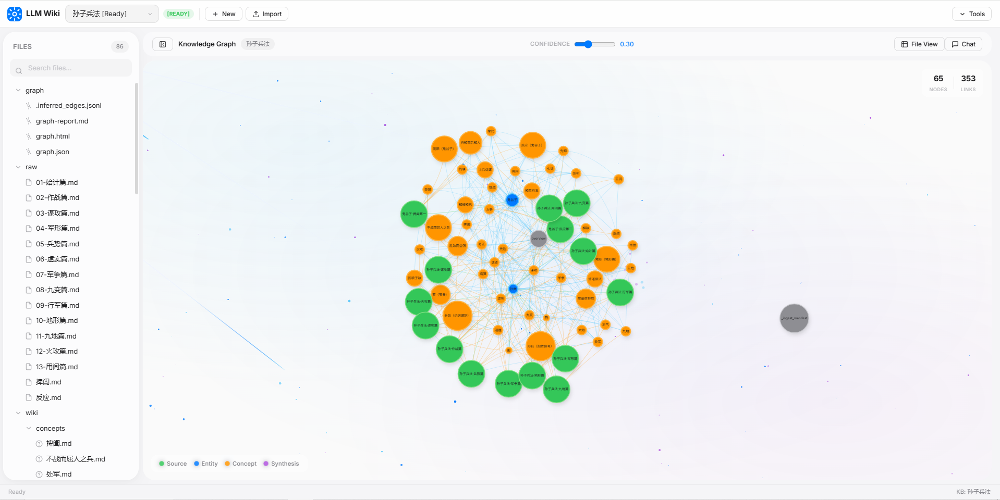

# LLM Wiki Engine

一个由 LLM 驱动的企业级知识库引擎，支持文档自动摄入、知识图谱构建、自然语言查询与图谱自愈。

> 本项目参考 [SamurAIGPT/llm-wiki-agent](https://github.com/SamurAIGPT/llm-wiki-agent) 的设计理念与架构，在其基础上进行了大量重构与增强，包括：SQLite 多项目存储、MCP Server 集成、Vue 3 现代化前端、多格式文档支持、图谱自愈等。

## 主视图



## 特性

- **多格式文档摄入**：支持 Markdown 直接读取，PDF/DOCX/PPTX/XLSX 等 20+ 格式通过 markitdown 自动转换
- **LLM 驱动的知识提取**：自动提取实体、概念、关系，生成结构化 Wiki 页面
- **知识图谱**：基于 wikilink 和语义推理构建交互式图谱，支持社区检测与可视化
- **自然语言查询**：对知识库进行自然语言提问，LLM 综合多页面生成带引用的答案（支持流式输出）
- **图谱自愈**：自动检测缺失的实体页面并生成定义，修复断裂链接
- **健康检查**：结构检查（零 LLM 调用）+ 内容质量检查（LLM 语义分析）
- **REST API**：完整的 Flask 后端服务，支持前端 Web 界面与外部系统集成
- **MCP Server**：内置 Model Context Protocol 服务，AI 客户端可直接操作知识库
- **多知识库管理**：基于 SQLite 的多知识库隔离存储，支持 FTS5 全文搜索
- **Vue 3 前端**：现代化 Web UI（ui-apple），支持知识库管理、文件浏览、知识图谱可视化与对话式查询

## 快速开始

### 环境要求

- Python 3.10+
- Node.js 20+（前端构建需要）
- uv（Python 包管理器）

### 后端配置

1. 进入后端目录：

```bash
cd server
```

2. 创建虚拟环境并安装依赖：

```bash
uv venv --python 3.13
.venv\Scripts\Activate.ps1  # Windows PowerShell
uv pip install -i https://pypi.tuna.tsinghua.edu.cn/simple -r requirements.txt
```

3. 配置环境变量：

复制 `.env.example` 为 `.env`，配置 LLM API：

```env
# LLM API 配置
LLM_MODEL=deepseek-v4-flash
LLM_MODEL_FAST=deepseek-v4-flash
OPENAI_API_KEY=your_api_key
OPENAI_API_BASE=https://api.deepseek.com/v1

# 服务端口
API_PORT=5000
MCP_PORT=8081
```

4. 启动服务：

```bash
cd server
python api_server.py
```

5. 构建并访问 Web UI（生产/一体化模式）：

```bash
cd ui-apple
npm install
npm run build
```

然后访问 `http://localhost:5000` 进入 Web UI。

> 若未执行 `npm run build`，`http://localhost:5000` 仅提供 API。开发时请使用下方「前端开发」模式。

### 前端开发（可选）

前端为 Vue 3 + Vite 项目，位于 `ui-apple/` 目录。开发时需**同时**启动后端与 Vite：

```bash
# 终端 1：后端
cd server
python api_server.py

# 终端 2：前端
cd ui-apple
npm install
npm run dev      # 开发模式，默认 http://localhost:5173（API 通过代理转发到 5000）
```

```bash
cd ui-apple
npm run build    # 生产构建，输出到 ui-apple/dist/（也可被 Flask 自动托管）
```

Docker 部署时会自动构建前端并内嵌到 Flask 服务中。

---

## 项目文件结构

```
llm-wiki-engine/
├── server/                          # 后端服务
│   ├── wiki_engine/                 # 核心引擎模块
│   │   ├── __init__.py              # 模块初始化
│   │   ├── __main__.py              # 支持 python -m wiki_engine 运行
│   │   ├── cli.py                   # 命令行入口（build/update/query/lint/health/graph/heal 等子命令）
│   │   ├── constants.py             # 全局常量（文件扩展名、图谱颜色方案、默认路径）
│   │   ├── engine.py                # 主引擎 LLMWikiEngine（组装所有功能模块的统一接口）
│   │   ├── kbs.py                   # 知识库管理（KbManager）与文件导入（FileImporter）
│   │   ├── ingest.py                # 知识库构建与摄入工作流（IngestWorkflow）
│   │   ├── query.py                 # 知识库查询工作流（QueryWorkflow）
│   │   ├── health.py                # 健康检查与内容质量检查（HealthWorkflow）
│   │   ├── graph.py                 # 知识图谱构建（GraphWorkflow）
│   │   ├── heal.py                  # 图谱自愈（HealWorkflow）
│   │   ├── export.py                # 知识库导出与全文搜索（ExportManager）
│   │   ├── helpers.py               # 辅助方法（Wiki 上下文构建、索引更新、日志追加等）
│   │   └── prompt/                  # LLM Prompt 模板
│   │       ├── __init__.py
│   │       └── prompts.py           # 摄入/查询/图谱推理/自愈/质量检查等 Prompt
│   ├── storage/                     # 数据存储层
│   │   ├── __init__.py
│   │   ├── db.py                    # SQLite 数据库封装（WikiStorage 类，知识库 CRUD、文件 CRUD、全文搜索、目录树）
│   │   └── schema.sql               # 数据库表结构定义（FTS5 全文搜索、级联删除、自动触发器）
│   ├── tools/                       # 独立工具脚本
│   │   ├── file_to_md.py            # 批量文件格式转换（任意格式 → Markdown）
│   │   ├── pdf2md.py                # PDF/arXiv 专用转换（支持 marker/pymupdf4llm/arxiv2md 后端）
│   │   ├── refresh.py               # 源文档刷新（基于 SHA-256 哈希检测变化）
│   │   ├── utils.py                 # 通用工具函数（LLM 调用、wikilink 提取、JSON 解析等）
│   │   ├── health.py                # 独立健康检查脚本
│   │   └── logger.py                # 日志工具
│   ├── docs/                        # 文档
│   │   ├── automated-sync.md
│   │   └── automated-sync_zh.md
│   ├── .env.example                 # 环境变量示例
│   ├── api_server.py                # Flask REST API 后端 + MCP Server 入口
│   ├── requirements.txt             # Python 依赖
│   ├── pyproject.toml               # 项目配置（PEP 621）
│   ├── FORMATS.md                   # Wiki 页面格式规范
│   └── uv.lock                      # uv 依赖锁定文件
├── ui-apple/                        # Vue 3 前端（Apple 风格 UI）
│   ├── src/
│   │   ├── components/
│   │   │   ├── ChatPanel.vue        # 对话式知识库查询面板
│   │   │   ├── DetailPanel.vue      # 文件详情/编辑面板
│   │   │   ├── FileView.vue         # 文件内容渲染视图
│   │   │   ├── GraphView.vue        # 知识图谱可视化（vis-network）
│   │   │   ├── ModalGroup.vue       # 通用模态框组件
│   │   │   ├── Sidebar.vue          # 知识库/文件树侧边栏
│   │   │   ├── StatusBar.vue        # 状态栏
│   │   │   └── Topbar.vue           # 顶部导航栏
│   │   ├── styles/
│   │   │   └── styles.css
│   │   ├── utils/
│   │   │   ├── api.js               # API 请求封装
│   │   │   └── markdown.js          # Markdown 渲染工具
│   │   ├── App.vue                  # 根组件
│   │   └── main.js                  # 入口文件
│   ├── index.html
│   ├── package.json
│   ├── vite.config.js
│   └── package-lock.json
├── skills/                          # Agent / 运维 Skill 工具包
│   └── llm-wiki-upload/             # 本机文件 multipart 上传（替代 MCP base64）
│       ├── SKILL.md                 # Skill 说明（中文）
│       ├── reference.md             # API 细节
│       └── scripts/
│           └── upload.py            # 上传脚本（仅标准库）
├── .dockerignore
├── .gitignore
├── AGENTS.md                        # Agent / 项目指引
├── Dockerfile                       # 多阶段 Docker 构建（前端 + 后端）
├── LICENSE
└── README.md
```

---

## 核心模块说明

### wiki_engine/engine.py — 主引擎

`LLMWikiEngine` 类提供统一的对外接口，内部委托给各专业模块：

| 方法 | 说明 |
|------|------|
| `create_kb(name, description)` | 创建知识库，返回知识库 ID |
| `list_kbs()` | 列出所有知识库 |
| `delete_kb(kb_id)` | 删除知识库 |
| `import_raw_files(kb_id, source_dir)` | 导入本地目录的原始文件，自动转换格式 |
| `add_raw_content(kb_id, filename, content)` | 添加单个原始文件内容 |
| `build_knowledge_base(kb_id)` | 完整构建知识库（摄入 + 可选图谱） |
| `update_knowledge_base(kb_id, source_dir)` | 增量更新知识库 |
| `query(kb_id, question)` | 查询知识库，返回 LLM 生成的答案 |
| `query_stream(kb_id, question)` | 流式查询知识库，逐块返回答案 |
| `health_check(kb_id)` | 结构健康检查（零 LLM 调用） |
| `lint(kb_id)` | 内容质量检查（含 LLM 语义分析） |
| `build_graph(kb_id)` | 构建知识图谱（含语义推理） |
| `heal_graph(kb_id)` | 图谱自愈，补全缺失实体页面 |
| `export_kb(kb_id, output_dir)` | 导出知识库到磁盘 |
| `search(kb_id, keyword)` | 全文搜索 |
| `get_kb_stats(kb_id)` | 获取知识库统计 |
| `quick_build(kb_name, source_dir)` | 一键构建（创建知识库 → 导入 → 构建） |

### wiki_engine/cli.py — 命令行接口

通过 `python -m wiki_engine` 调用，支持以下子命令：

| 命令 | 说明 | 关键参数 |
|------|------|----------|
| `build` | 构建知识库 | `--kb`, `--source`, `--no-convert`, `--skip-graph` |
| `update` | 增量更新知识库 | `--kb-id`, `--source` |
| `query` | 查询知识库 | `--kb-id`, `--question`, `--save` |
| `lint` | 内容质量检查 | `--kb-id`, `--save` |
| `health` | 结构健康检查 | `--kb-id` |
| `graph` | 构建知识图谱 | `--kb-id` |
| `list` | 列出所有知识库 | — |
| `stats` | 知识库统计 | `--kb-id` |
| `heal` | 图谱自愈 | `--kb-id`, `--min-refs`, `--max-sources`, `--model` |

### storage/db.py — 数据存储

`WikiStorage` 类封装 SQLite 操作，基于 [schema.sql](file:///c:/Users/ChengCihang/VSCode/llm-wiki-engine/server/storage/schema.sql) 定义的表结构：

| 方法 | 说明 |
|------|------|
| `create_kb(name, description)` | 创建知识库 |
| `delete_kb(kb_id)` | 删除知识库及关联文件（级联删除） |
| `get_kb(kb_id)` / `get_kb_by_name(name)` | 获取知识库信息 |
| `list_kbs()` | 列出所有知识库 |
| `add_file(kb_id, relative_path, content)` | 添加/替换文件（自动更新 FTS 索引） |
| `get_file_text_by_path(kb_id, relative_path)` | 获取文件文本内容 |
| `list_files(kb_id, prefix)` | 列出文件（支持目录前缀过滤） |
| `get_directory_tree(kb_id)` | 获取嵌套目录树结构 |
| `search(kb_id, keyword)` | 全文搜索（FTS5） |
| `export_kb(kb_id, output_dir)` | 导出知识库到磁盘目录 |
| `import_directory(kb_id, dir_path)` | 从磁盘导入目录 |
| `kb_stats(kb_id)` | 知识库统计（文件数、大小、分类分布） |
| `set_kb_state(kb_id, state)` | 更新知识库状态（unbuilt/building/completed） |

---

## REST API 接口

启动服务：`cd server && python api_server.py`，访问 `http://localhost:5000`

### 知识库 API

| 方法 | 路径 | 说明 |
|------|------|------|
| GET | `/api/kbs` | 列出所有知识库 |
| POST | `/api/kbs` | 创建知识库（body: `{name, description}`） |
| GET | `/api/kbs/<id>` | 获取知识库详情 |
| DELETE | `/api/kbs/<id>` | 删除知识库 |
| GET | `/api/kbs/<id>/stats` | 获取知识库统计 |
| GET | `/api/kbs/<id>/instruction` | 获取构建指令 |
| PUT | `/api/kbs/<id>/instruction` | 更新构建指令（body: `{instruction}`） |

### 文件 API

| 方法 | 路径 | 说明 |
|------|------|------|
| GET | `/api/kbs/<id>/tree` | 获取文件目录树 |
| GET | `/api/kbs/<id>/files?prefix=` | 列出文件（支持 prefix 过滤） |
| GET | `/api/kbs/<id>/files/<path>` | 获取文件内容 |
| PUT | `/api/kbs/<id>/files/<path>` | 更新文件内容（body: `{content}`） |

### 知识图谱 API

| 方法 | 路径 | 说明 |
|------|------|------|
| GET | `/api/kbs/<id>/graph?file=` | 获取知识图谱 JSON 数据 |
| GET | `/api/kbs/<id>/graph/files` | 列出图谱目录下的文件 |

### 搜索 API

| 方法 | 路径 | 说明 |
|------|------|------|
| GET | `/api/kbs/<id>/search?q=` | 全文搜索（FTS5） |

### 引擎工作流 API

| 方法 | 路径 | 说明 |
|------|------|------|
| POST | `/api/kbs/<id>/build` | 构建知识库（完整流程） |
| POST | `/api/kbs/<id>/update` | 增量更新知识库（body: `{source_dir}` 可选） |
| POST | `/api/kbs/<id>/query` | 查询知识库（body: `{question, stream}`） |
| GET | `/api/kbs/<id>/health` | 健康检查 |
| POST | `/api/kbs/<id>/lint` | 内容质量检查 |
| POST | `/api/kbs/<id>/graph/build` | 构建知识图谱 |

### 文件上传与导入导出 API

| 方法 | 路径 | 说明 |
|------|------|------|
| POST | `/api/kbs/<id>/import` | 从本地目录导入（body: `{source_dir}`） |
| POST | `/api/kbs/<id>/import-zip` | 上传 ZIP 压缩包导入（multipart/form-data） |
| POST | `/api/kbs/<id>/upload-file` | 上传单个文件/ZIP 到知识库（query: `update=true` 可选增量更新） |
| GET | `/api/kbs/<id>/export` | 导出知识库为 ZIP 下载 |
| POST | `/api/kbs/import` | 导入知识库 ZIP 包恢复完整知识库（multipart/form-data） |
| POST | `/api/external/upload` | 外部系统上传（multipart/form-data，form: `kb_name`, `files[]`） |

---

## 工作流说明

### 典型使用流程

```bash
cd server

# 1. 命令行一键构建
python -m wiki_engine build --kb "my-docs" --source ./local

# 2. 查询知识
python -m wiki_engine query --kb-id 1 --question "核心概念是什么？"

# 3. 健康检查
python -m wiki_engine health --kb-id 1

# 4. 构建知识图谱
python -m wiki_engine graph --kb-id 1

# 5. 图谱自愈
python -m wiki_engine heal --kb-id 1 --min-refs 3
```

### API 调用示例

```bash
# 创建知识库
curl -X POST http://localhost:5000/api/kbs \
  -H "Content-Type: application/json" \
  -d '{"name": "my-project", "description": "测试项目"}'

# 构建知识库
curl -X POST http://localhost:5000/api/kbs/1/build

# 查询（非流式）
curl -X POST http://localhost:5000/api/kbs/1/query \
  -H "Content-Type: application/json" \
  -d '{"question": "项目的主要内容是什么？"}'

# 查询（流式 SSE）
curl -X POST http://localhost:5000/api/kbs/1/query \
  -H "Content-Type: application/json" \
  -d '{"question": "项目的主要内容是什么？", "stream": true}'

# 外部上传文件
curl -X POST http://localhost:5000/api/external/upload \
  -F "kb_name=my-project" \
  -F "files=@document.pdf"
```

---

## MCP Server

LLM Wiki Engine 内置了 MCP (Model Context Protocol) Server，以 Streamable HTTP 方式运行，允许 AI 客户端（如 Claude Code、Cursor、Trae 等）直接调用知识库引擎的全部能力。

### 启动方式

MCP Server 随 API 服务一同启动（`python api_server.py`），默认监听 `8081` 端口。仅在非 debug 模式下自动启动，debug 模式下禁用（避免 Flask reloader 端口冲突）。

```bash
# 启动 API + MCP 服务
cd server
python api_server.py

# 启动日志输出：
#   MCP 服务: http://localhost:8081/mcp
```

### 环境变量

| 变量 | 默认值 | 说明 |
|------|--------|------|
| `MCP_PORT` | `8081` | MCP Streamable HTTP 服务端口 |
| `API_PORT` | `5000` | Flask API 服务端口 |
| `MCP_ALLOWED_HOSTS` | （空） | 额外允许的 Host（逗号分隔）。跨 Docker/局域网访问必填，否则返回 `421 Invalid Host header` |
| `MCP_DNS_REBINDING_PROTECTION` | `1` | 设为 `0` 可关闭 Host 校验（仅可信内网） |

在 `server/.env` 中配置：

```env
# 服务端口
API_PORT=5000
MCP_PORT=8081
# Docker 跨容器 / 局域网访问示例：
# MCP_ALLOWED_HOSTS=192.168.7.203,host.docker.internal,backend
```

### AI 客户端配置

**Claude Code / Claude 桌面端** (`claude_desktop_config.json`)：

```json
{
  "mcpServers": {
    "llm-wiki-engine": {
      "type": "url",
      "url": "http://localhost:8081/mcp"
    }
  }
}
```

**Trae IDE** (`.trae/mcp.json`)：

```json
{
  "mcpServers": {
    "llm-wiki-engine": {
      "type": "url",
      "url": "http://localhost:8081/mcp"
    }
  }
}
```

**QwenPaw（与 llm-wiki 同宿主机、不同 Docker 容器）**：容器内 `localhost` 指向自身，需用宿主机网关或发布端口可达地址，并在服务端配置 `MCP_ALLOWED_HOSTS`：

```json
{
  "mcpServers": {
    "llm-wiki-engine": {
      "transport": "streamable_http",
      "url": "http://host.docker.internal:8081/mcp"
    }
  }
}
```

也可用宿主机局域网 IP（如 `http://192.168.7.203:8081/mcp`），但服务端 `.env` 必须包含该 Host：`MCP_ALLOWED_HOSTS=192.168.7.203`。保存后在 QwenPaw MCP 列表中启用客户端，必要时 `/daemon restart`。

**通用 Streamable HTTP MCP 客户端**：端点地址为 `http://<host>:<MCP_PORT>/mcp`。

### MCP 工具列表

| 工具名称 | 说明 | 关键参数 |
|---------|------|---------|
| `list_kbs` | 列出所有知识库及状态 | — |
| `create_kb` | 创建空知识库 | `name`, `description` |
| `import_kb` | 从 ZIP 创建知识库并导入 | `zip_url` / `content_base64` / `file_path`, `kb_name` |
| `export_kb` | 导出知识库为 Base64 ZIP | `kb_id` |
| `delete_kb` | 删除知识库（不可逆） | `kb_id`, `confirm=true` |
| `build_knowledge` | 构建/增量更新知识库 | `kb_id`, `instruction`, `incremental` |
| `upload_files` | 向已有知识库追加文件 | `kb_id`, `file_path` / `content_base64` + `file_name`, `auto_update` |
| `query_knowledge` | 自然语言查询知识库 | `kb_id`, `question` |
| `search_files` | 全文搜索 | `kb_id`, `keyword` |
| `read_wiki_file` | 读取知识库中指定文件内容 | `kb_id`, `relative_path` |

### 典型 MCP 工作流

AI 客户端通过 MCP 可实现端到端知识库管理：

1. `create_kb` 创建空知识库
2. **上传文档**：跨 Docker / 本机文件请优先用 [Skill：本地文件上传](#skill本地文件上传llm-wiki-upload)，避免 MCP `content_base64`；仅当文件已在 MCP 服务端磁盘时才用 `upload_files` + `file_path`
3. `build_knowledge` 构建知识库（可传入 `instruction` 定制编译行为）
4. `query_knowledge` 对知识库提问
5. `read_wiki_file` 读取具体 Wiki 页面内容
6. `export_kb` 导出知识库（便于迁移/备份）
7. `delete_kb` 清理不需要的知识库

---

## Skill：本地文件上传（llm-wiki-upload）

目录：[`skills/llm-wiki-upload/`](skills/llm-wiki-upload/)

### 解决什么问题

MCP Streamable HTTP 的 `upload_files` 在跨容器场景下不方便：

| 方式 | 问题 |
|------|------|
| `file_path` | 读的是 **MCP 服务端**路径，不是 Agent / QwenPaw 本机路径 |
| `content_base64` | 体积膨胀约 33%、中文易乱码、大文件不现实 |

本 Skill 在 **能读本地文件的一侧** 调用 REST `multipart/form-data` 二进制上传，无 Base64。列表 / 查询 / 构建仍用 MCP；日常加文档也可继续用 Web 前端上传。

### 用法

```bash
# 环境变量（可选），默认 http://127.0.0.1:5000
# 跨 Docker 示例：export LLM_WIKI_API=http://host.docker.internal:5000

# 列出知识库
python skills/llm-wiki-upload/scripts/upload.py --list-kbs

# 按知识库 ID 上传
python skills/llm-wiki-upload/scripts/upload.py --kb-id 1 --file /path/to/doc.md

# 多文件；加 --update 时仅在最后一次上传后做增量更新
python skills/llm-wiki-upload/scripts/upload.py --kb-id 1 --file a.pdf --file b.docx --update

# 按名称上传（知识库不存在则创建）
python skills/llm-wiki-upload/scripts/upload.py --kb-name wiki --file /path/to/doc.md
```

说明文档：[`skills/llm-wiki-upload/SKILL.md`](skills/llm-wiki-upload/SKILL.md)；接口细节：[`skills/llm-wiki-upload/reference.md`](skills/llm-wiki-upload/reference.md)。

---

## 前端 UI（ui-apple）

项目包含一个基于 Vue 3 + Vite 的现代化 Web 前端，采用 Apple 设计风格：

- **知识库管理**：创建、切换、删除知识库，查看构建状态
- **文件浏览**：树形目录结构浏览 raw/wiki/graph 文件内容
- **知识图谱可视化**：基于 vis-network 的交互式力导向图，支持社区检测着色
- **对话式查询**：内置聊天面板，支持自然语言查询知识库
- **文件编辑**：支持在线编辑 Wiki 页面内容

### 开发

```bash
cd ui-apple
npm install
npm run dev       # 开发服务器 http://localhost:5173
npm run build     # 生产构建
```

Docker 部署时，前端构建产物自动内嵌到 Flask 静态服务中。

---

## Docker 部署

### 构建镜像

```bash
docker build -t llm-wiki .
```

构建过程：
1. **Stage 1**：使用 Node.js 构建 ui-apple 前端
2. **Stage 2**：基于 Python 3.13-slim，安装后端依赖并复制前端构建产物

### 运行容器

```bash
docker run -d -p 5000:5000 -p 8081:8081 \
  -e LLM_MODEL=deepseek-v4-flash \
  -e LLM_MODEL_FAST=deepseek-v4-flash \
  -e OPENAI_API_KEY=your-api-key \
  -e OPENAI_API_BASE=https://api.deepseek.com/v1 \
  -e MCP_PORT=8081 \
  --name llm-wiki \
  llm-wiki
```

### 挂载持久化数据

```bash
docker run -d -p 5000:5000 -p 8081:8081 \
  -v $(pwd)/server/storage:/app/server/storage \
  -v $(pwd)/server/uploads:/app/server/uploads \
  -e LLM_MODEL=deepseek-v4-flash \
  -e OPENAI_API_KEY=your-api-key \
  -e OPENAI_API_BASE=https://api.deepseek.com/v1 \
  -e MCP_PORT=8081 \
  --name llm-wiki \
  llm-wiki
```

---

## 技术栈

| 层级 | 技术 |
|------|------|
| **后端语言** | Python 3.10+ |
| **Web 框架** | Flask + Flask-CORS |
| **MCP 协议** | FastMCP（Streamable HTTP） |
| **数据存储** | SQLite（FTS5 全文搜索、WAL 模式） |
| **LLM 调用** | litellm（兼容 OpenAI 接口的任意 LLM 服务） |
| **文档转换** | markitdown（支持 PDF/DOCX/PPTX/XLSX 等 20+ 格式） |
| **前端框架** | Vue 3 + Vite |
| **图谱可视化** | vis-network（力导向图） |
| **包管理** | uv（Python）/ npm（前端） |
| **容器化** | Docker（多阶段构建） |

---

## 参考项目

本项目参考 [SamurAIGPT/llm-wiki-agent](https://github.com/SamurAIGPT/llm-wiki-agent) 的设计理念与核心架构，并在此基础上进行了以下增强：

- **存储层重构**：从文件系统存储升级为 SQLite 多知识库存储，支持 FTS5 全文搜索
- **多知识库支持**：从单一知识库扩展为多知识库隔离管理
- **MCP Server 集成**：新增 MCP Streamable HTTP 服务，支持 AI 客户端直接操作知识库
- **现代化前端**：新增 Vue 3 + Vite 前端（ui-apple），支持图谱可视化与对话式查询
- **图谱自愈**：新增自动检测并补全缺失实体页面的能力
- **多格式文档支持**：集成 markitdown，支持 20+ 文档格式自动转换
- **流式查询**：支持 SSE 流式输出查询结果
- **Docker 部署**：提供多阶段 Docker 构建，前后端一体化部署

## 许可证

MIT License